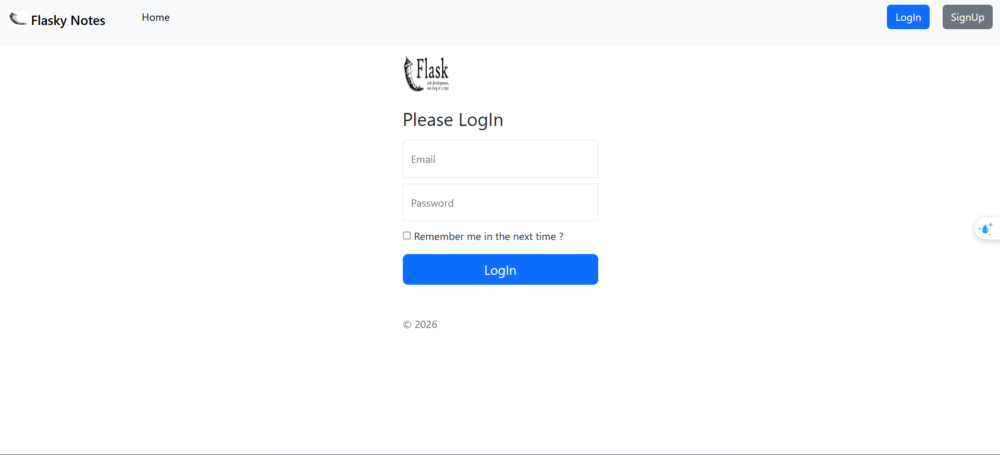
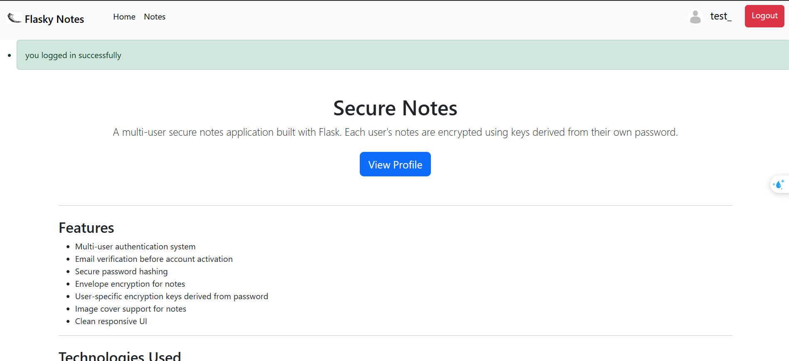
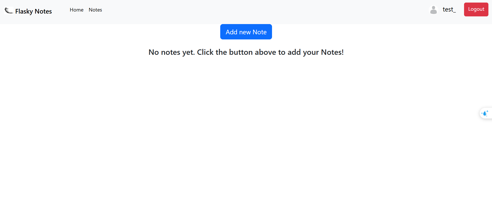
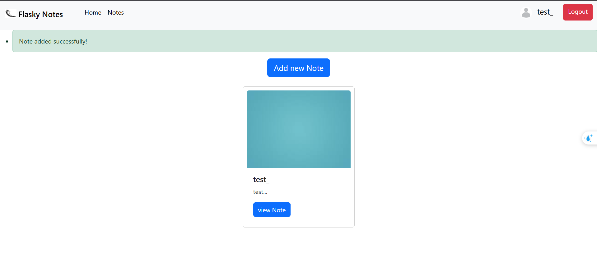
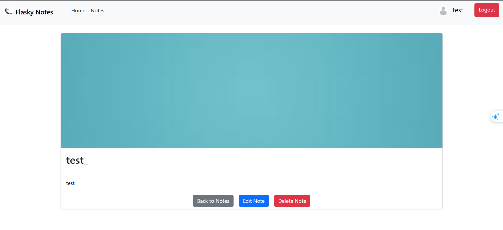
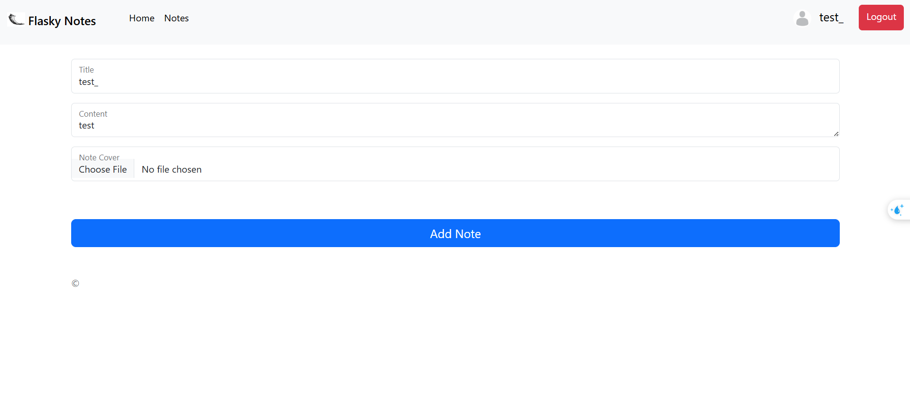
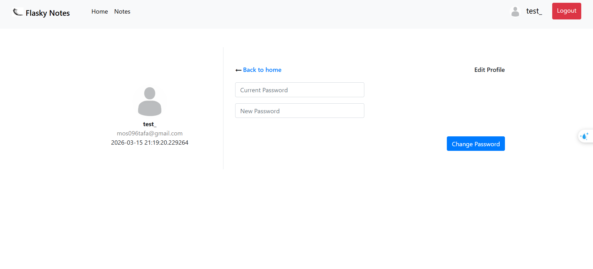
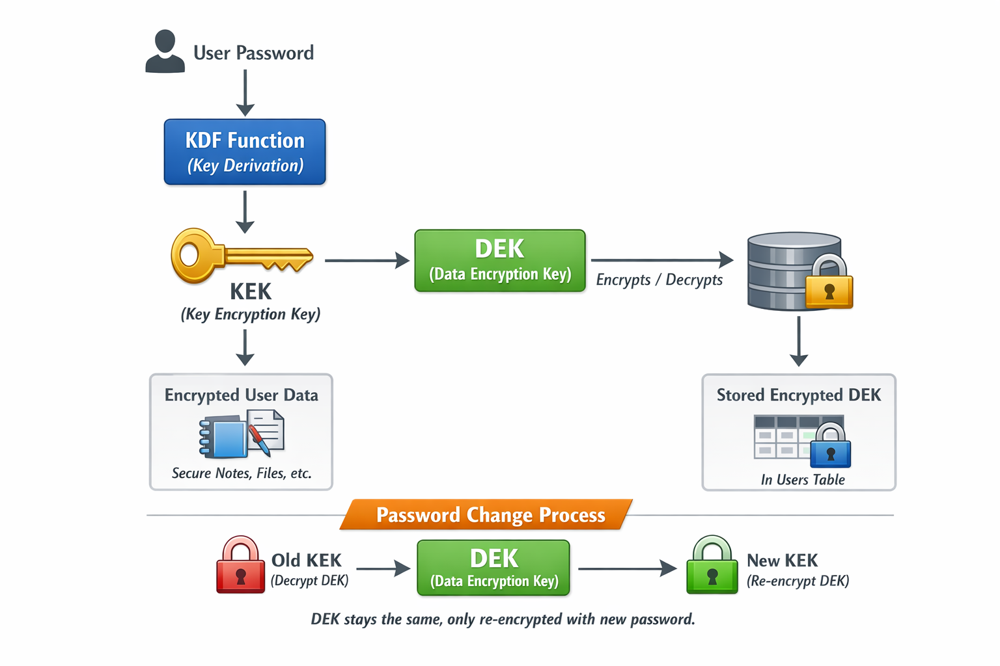

# Flasky_Notes web app

# Secure Notes – Encrypted Multi-User Notes Application

Secure Notes is a web application that allows users to create and manage private notes with strong encryption and authentication mechanisms.
The project demonstrates secure backend design using Flask and modern Python libraries.

---

## Overview

This application allows multiple users to create personal notes that are securely stored and encrypted.
Each user's notes are protected using encryption keys derived from their password, ensuring that even if the database is compromised, the content remains unreadable.

The project focuses on **security practices**, **modular architecture**, and **clean backend design**.

---

## App Photos 








## Features

* Multi-user authentication system
* Email verification before account activation
* Secure password hashing
* Encrypted note storage
* Envelope encryption design
* Cover image support for notes
* Clean and responsive UI
* Modular Flask application structure
* Service-layer architecture

---

## Security Design

The application uses an **Envelope Encryption model**:

1. Each note is encrypted using a **Data Encryption Key (DEK)**.
2. The DEK itself is encrypted using a **Key Encryption Key (KEK)**.
3. The KEK is derived from the user's password using a **Key Derivation Function (KDF)**.
4. User passwords are securely hashed and never stored in plaintext.



This ensures:

* Encrypted note storage
* Strong protection even if the database is leaked
* User-specific encryption keys

---

## Technologies Used

* Python
* Flask
* Jinja2
* Flask-Login
* Flask-SQLAlchemy
* Flask-Mailman
* Cryptography
* Bcrypt

---

## Project Structure

The project follows a **modular Flask architecture**:
```
app/
│
├── auth/           # Authentication routes and forms
├── main/           # Main application routes
├── models/         # Database models
├── services/       # Business logic and encryption services
├── templates/      # Jinja templates
├── static/         # CSS, images, and uploaded files
│
└── extensions.py   # Flask extensions initialization
```
---

---
```
app/
│
├── auth/
│   ├── routes.py
│   ├── forms.py
│
├── main/
│   ├── routes.py
│
├── services/
│   ├── encryption.py
│   ├── user_service.py
│   ├── note_service.py
│
├── models/
│   ├── user.py
│   ├── note.py
│
├── templates/
│
├── static/
│
├── extensions.py
└── __init__.py
```
---
## Example Use Cases

* Secure personal notes
* Learning backend security practices
* Demonstrating Flask architecture patterns
* Portfolio project for backend development

---
## How to use
1- clone repo 
2- into repo directory run next command
```
pip install -r requirements.text
```
3- in config.py put email and emaill's app password to use it to send email
```
    MAIL_USERNAME = ''
    MAIL_PASSWORD = ''
```
4- then run command 
```
python run.py
or
flask run

```

## Future Improvements

* Note sharing with encrypted permissions
* API version of the application
* Docker deployment
* Full text search
* auto remove not activated accounts (by threads script)
---

## Author

Mostafa Ahmed (mostafa-12)

Backend development learning project focused on Flask architecture and application security.
